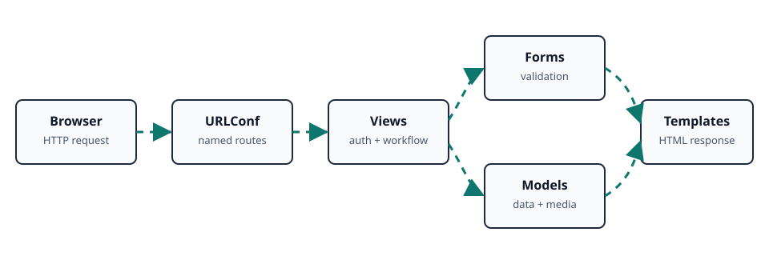

# Django Personal Portfolio

An authenticated Django portfolio workspace for developers who need to manage a personal profile, upload and maintain multiple resumes, and receive contact messages from one browser-based dashboard. It combines account management with structured resume presentation and media uploads in a small, maintainable project.

## Contents

- [Key Features](#key-features)
- [Tech Stack](#tech-stack)
- [Architecture](#architecture)
- [Django Template Setup](#django-template-setup)
- [Context Data](#context-data)
- [Pages and Tools Setup](#pages-and-tools-setup)
- [Getting Started](#getting-started)
- [Environment Variables](#environment-variables)
- [Navigation Pages and URL Names](#navigation-pages-and-url-names)
- [Usage](#usage)
- [Recommended Future Additions](#recommended-future-additions)
- [License](#license)
- [Contact](#contact)

## Key Features

- **Custom authentication:** Register, log in, log out, and change passwords with Django's authentication framework.
- **Profile management:** Store a user's full name, phone number, profile photo, and profile creation timestamp.
- **Resume workspace:** Create, view, edit, delete, and download resume records with supporting profile and career information.
- **Contact collection:** Accept name, phone number, and message submissions through a Django model form.
- **Media uploads:** Handle profile photos and resume files through Django's media URL configuration.
- **Admin management:** Manage users, profiles, resumes, and contact records through Django Admin.
- **Responsive interface:** Use Bootstrap 5 components and Bootstrap Icons across the shared navigation and forms.
- **SQLite persistence:** Run locally with the included SQLite database and Django migrations.

## Tech Stack

| Layer         | Technology                                                                                   |
| ------------- | -------------------------------------------------------------------------------------------- |
| Backend       | Python, Django 5.2.x                                                                         |
| Database      | SQLite 3                                                                                     |
| Forms         | Django Model Forms, django-crispy-forms, crispy-bootstrap5                                   |
| Frontend      | Django Templates, HTML5, CSS3, Bootstrap 5, Bootstrap Icons                                  |
| Media         | Pillow, Django `ImageField` and `FileField`                                                  |
| Configuration | Django settings module; `python-decouple` is available for future externalized configuration |

## Architecture

The request flow is intentionally small: Django routes requests to portfolio views, views use forms and models, and templates render the resulting context. Authenticated pages are protected with `login_required`; uploaded media is served from the configured media directory during development.

<p align="center">
  
</p>

| Layer            | Responsibility                                                                    |
| ---------------- | --------------------------------------------------------------------------------- |
| Browser          | Sends authentication, profile, resume, and contact requests.                      |
| URLConf          | Maps paths to view functions and stable URL names.                                |
| Views            | Enforce authentication, validate submissions, save records, and select templates. |
| Forms and models | Validate input and persist user, profile, resume, and contact data.               |
| Templates        | Render the shared navigation and page-specific HTML response.                     |

The diagram is stored as a standalone SVG asset so GitHub, VS Code, and normal browsers can render it as an image. CSS-styled SVG vectors preserve sharpness at any display size, while the `prefers-reduced-motion` rule disables animation for users who request less motion. Open [docs/architecture.svg](docs/architecture.svg) directly in a browser to view the diagram by itself.

## Django Template Setup

Templates are discovered from the app because `APP_DIRS` is enabled in the project settings. Shared layout and navigation live under `portfolio/templates/master/`.

```python
# mehedi_alam_001103_portfolio/settings.py
TEMPLATES = [
		{
				"BACKEND": "django.template.backends.django.DjangoTemplates",
				"DIRS": [],
				"APP_DIRS": True,
		},
]
```

Extend the base template and render a view context with Django template tags:

```django



	<h1>{{ resume.title }}</h1>
	
		<a href="{{ resume.file.url }}" target="_blank" rel="noreferrer">View resume</a>
	

```

## Context Data

The main context objects currently passed by views are:

```python
# portfolio/views.py
return render(request, "addResumeField.html", {"form": form})
return render(request, "viewResumeList.html", {"resumes": ResumeModel.objects.all()})
return render(request, "resume_detail.html", {"resume": resume})
return render(request, "resume_edit.html", {"form": form, "resume": resume})
return render(request, "contactpage.html", {"form": form})
```

Authenticated templates also access the logged-in user through Django's auth context processor:

```django
{{ request.user.username }}
{{ request.user.profile.fullName }}
{{ request.user.profile.profilePhoto.url }}
```

## Pages and Tools Setup

This section follows the application flow from shared layout to authentication, profile management, resume management, contact capture, and administration. Each page is backed by a named URL in `portfolio/urls.py` and a view in `portfolio/views.py`.

### 1. Shared Template Layout

`master/base.html` is the layout shell. It loads Bootstrap 5.3.3 and Bootstrap Icons, includes the navigation partial, exposes the `body` block, and loads Bootstrap's JavaScript bundle.

```django
<!-- portfolio/templates/master/base.html -->





<script src="https://cdn.jsdelivr.net/npm/bootstrap@5.3.3/dist/js/bootstrap.bundle.min.js"></script>
```

Every authenticated page that uses the shared shell should extend it rather than duplicating the document layout:

```django



	<main class="container py-5">
		<!-- Page-specific content -->
	</main>

```

`master/navbar.html` provides links to the dashboard, resume pages, contact page, profile, password change, and logout. Links use `` with route names so path changes do not require template-wide replacements.

### 2. Login Page

**Template:** `portfolio/templates/loginPage.html`  
**View:** `loginPage`  
**URL:** `/`  
**Access:** Public

The login page accepts a username and password. The view calls Django's `authenticate()` function, creates a session with `login()`, and redirects successful users to `profile`. Invalid credentials are returned to the page through Django messages.

```django
<form method="post">
	
	<input name="username" type="text" autocomplete="username" required>
	<input name="password" type="password" autocomplete="current-password" required>
	<button type="submit">Login</button>
</form>

<a href="">Create an account</a>
```

```python
# portfolio/views.py
user = authenticate(username=username, password=password)
if user is not None:
		login(request, user)
		return redirect("profile")
messages.error(request, "Invalid username or password.")
```

### 3. Registration Page

**Template:** `portfolio/templates/registerPage.html`  
**View:** `registerPage`  
**URL:** `/registerPage/`  
**Access:** Public

Registration collects a username, email, password, and password confirmation. The view checks password equality and uniqueness of username and email, creates a `CustomUserModel` with `create_user()`, and creates the related `ProfileModel` automatically.

```django
<form method="post">
	
	<input name="username" required>
	<input name="email" type="email" required>
	<input name="password" type="password" autocomplete="new-password" required>
	<input name="confirm_password" type="password" autocomplete="new-password" required>
	<button type="submit">Sign up</button>
</form>
```

```python
user = CustomUserModel.objects.create_user(
		username=username,
		email=email,
		password=password,
)
ProfileModel.objects.create(user=user)
return redirect("loginPage")
```

### 4. Logout Action

**Template:** Navigation dropdown  
**View:** `logoutPage`  
**URL:** `/logoutPage/`  
**Access:** Public

Logout is an action endpoint rather than a standalone page. It clears the current Django session and redirects to the login page.

```django
<a href="">Logout</a>
```

```python
def logoutPage(request):
		logout(request)
		return redirect("loginPage")
```

### 5. Dashboard Page

**Template:** `portfolio/templates/home.html`  
**View:** `home`  
**URL:** `/home/`  
**Access:** Public in the current view

The dashboard displays the current user's profile information, including the profile name, creation date, and profile photo. In normal navigation it is reached after authentication, so a profile record should exist before opening it.

```python
def home(request):
		return render(request, "home.html")
```

```django
<h2>Hi, I'm {{ request.user.profile.fullName }}</h2>

```

For a public deployment, the dashboard should be split into a public portfolio view and an authenticated dashboard, or it should receive an explicit profile object instead of assuming `request.user.profile` exists.

### 6. Profile Page

**Template:** `portfolio/templates/profile.html`  
**View:** `profile`  
**URL:** `/profile/`  
**Access:** Authenticated

The profile page reads the logged-in user's `CustomUserModel` and related `ProfileModel`. It displays username, email, full name, phone, profile photo, and creation date, and links to profile editing.

```python
@login_required
def profile(request):
		return render(request, "profile.html")
```

```django

	

<p>{{ request.user.email }}</p>
<a href="">Update Profile</a>
```

### 7. Update Profile Page

**Template:** `portfolio/templates/updateProfile.html`  
**View:** `updateProfile`  
**URL:** `/updateProfile/`  
**Access:** Authenticated

`ProfileForm` updates only `fullName`, `phone`, and `profilePhoto`. Because a file can be uploaded, the form must use `multipart/form-data` and the view must receive both `request.POST` and `request.FILES`.

```python
class ProfileForm(forms.ModelForm):
		class Meta:
				model = ProfileModel
				fields = ["fullName", "phone", "profilePhoto"]
```

```django
<form method="post" enctype="multipart/form-data">
	
	{{ form.as_p }}
	<button type="submit">Update Profile</button>
</form>
```

```python
@login_required
def updateProfile(request):
		profile = request.user.profile
		form = ProfileForm(request.POST or None, request.FILES or None, instance=profile)
		if request.method == "POST" and form.is_valid():
				form.save()
				return redirect("profile")
		return render(request, "updateProfile.html", {"form": form})
```

### 8. Change Password Page

**Template:** `portfolio/templates/changePasswordPage.html`  
**View:** `changePassword`  
**URL:** `/changePassword/`  
**Access:** Authenticated

The page accepts the current password, new password, and confirmation. The view verifies the current password, updates the stored hash with `set_password()`, saves the user, and calls `update_session_auth_hash()` so the current session remains active.

```django
<form method="post">
	
	<input name="current_password" type="password" required>
	<input name="new_password" type="password" required>
	<input name="confirm_password" type="password" required>
	<button type="submit">Update Password</button>
</form>
```

```python
if not request.user.check_password(current_password):
		messages.error(request, "Current password is incorrect.")
elif new_password != confirm_password:
		messages.error(request, "New passwords do not match.")
else:
		request.user.set_password(new_password)
		request.user.save()
		update_session_auth_hash(request, request.user)
		return redirect("profile")
```

### 9. Add Resume Page

**Template:** `portfolio/templates/addResumeField.html`  
**View:** `addResume`  
**URL:** `/addResumeField/`  
**Access:** Authenticated

The add page uses `ResumeForm` to create a `ResumeModel`. All current resume fields are optional, including the uploaded resume file and profile image. The form supports both text input and file input.

```python
class ResumeForm(forms.ModelForm):
		class Meta:
				model = ResumeModel
				fields = [
						"title", "description", "file", "profile_pic", "name", "email",
						"phone_number", "address", "linkedin_url", "github_url",
						"portfolio_url", "education", "experience", "skills",
				]
```

```django
<form method="post" enctype="multipart/form-data"
			action="">
	
	{{ form.as_p }}
	<button type="submit">Save Resume</button>
</form>
```

```python
@login_required
def addResume(request):
		form = ResumeForm(request.POST or None, request.FILES or None)
		if request.method == "POST" and form.is_valid():
				form.save()
				return redirect("viewResumeList")
		return render(request, "addResumeField.html", {"form": form})
```

### 10. Resume List Page

**Template:** `portfolio/templates/viewResumeList.html`  
**View:** `viewResumeList`  
**URL:** `/viewResumeList/`  
**Access:** Authenticated

The list page receives a `resumes` queryset and renders each resume's title, description, file link, and available actions. An empty state is rendered when there are no records.

```python
@login_required
def viewResumeList(request):
		resumes = ResumeModel.objects.all()
		return render(request, "viewResumeList.html", {"resumes": resumes})
```

```django

	<h2>{{ resume.title }}</h2>
	<a href="">View</a>
	<a href="">Edit</a>
	<a href="">Delete</a>

	<p>No resumes available.</p>

```

### 11. Resume Detail Page

**Template:** `portfolio/templates/resume_detail.html`  
**View:** `resume_detail`  
**URL:** `/resume_detail/<id>`  
**Access:** Authenticated

The detail page receives one `resume` object and conditionally renders its file, profile image, personal information, education, experience, skills, and external links.

```python
@login_required
def resume_detail(request, id):
		resume = ResumeModel.objects.get(id=id)
		return render(request, "resume_detail.html", {"resume": resume})
```

```django
<h1>{{ resume.title }}</h1>

	<a href="{{ resume.file.url }}" target="_blank" rel="noreferrer">
		View Resume
	</a>

<p>{{ resume.education }}</p>
<p>{{ resume.experience }}</p>
<p>{{ resume.skills }}</p>
```

### 12. Edit Resume Page

**Template:** `portfolio/templates/resume_edit.html`  
**View:** `resume_edit`  
**URL:** `/resume_edit/<id>`  
**Access:** Authenticated

The edit page binds `ResumeForm` to an existing `ResumeModel` instance. `get_object_or_404()` returns a 404 response when the requested ID does not exist, and a successful update redirects to the detail page.

```python
@login_required
def resume_edit(request, id):
		resume = get_object_or_404(ResumeModel, id=id)
		form = ResumeForm(request.POST or None, request.FILES or None, instance=resume)
		if request.method == "POST" and form.is_valid():
				form.save()
				return redirect("resume_detail", id=resume.id)
		return render(request, "resume_edit.html", {"form": form, "resume": resume})
```

```django
<form method="post" enctype="multipart/form-data">
	
	{{ form.as_p }}
	<button type="submit">Save Changes</button>
</form>
```

### 13. Delete Resume Action

**Template:** Resume list action link  
**View:** `resume_delete`  
**URL:** `/resume_delete/<id>`  
**Access:** Authenticated

Delete is currently a direct action endpoint. The existing list page asks for browser confirmation and the view deletes the matching record before redirecting to the resume list.

```django
<a href=""
	 onclick="return confirm('Are you sure you want to delete this resume?')">
	Delete
</a>
```

```python
@login_required
def resume_delete(request, id):
		ResumeModel.objects.get(id=id).delete()
		return redirect("viewResumeList")
```

For production, implement this as a CSRF-protected POST form and use `get_object_or_404()`; the current GET deletion behavior is documented here so it is not mistaken for a recommended pattern.

### 14. Contact Page

**Template:** `portfolio/templates/contactpage.html`  
**View:** `contact_view`  
**URL:** `/contact`  
**Access:** Public

The contact page displays `ContactForm`, which maps to `ContactModel` fields `name`, `phone`, and `message`. A valid submission is saved and redirects to the dashboard.

```python
class ContactForm(forms.ModelForm):
		class Meta:
				model = ContactModel
				fields = "__all__"
```

```django
<form method="post" action="">
	
	{{ form.as_p }}
	<button type="submit">Send Message</button>
</form>
```

```python
def contact_view(request):
		form = ContactForm(request.POST or None)
		if request.method == "POST" and form.is_valid():
				form.save()
				return redirect("home")
		return render(request, "contactpage.html", {"form": form})
```

### 15. Django Admin Tool

**URL:** `/admin/`  
**Access:** Staff or superuser

The project registers `CustomUserModel`, `ProfileModel`, `ResumeModel`, and `ContactModel` in `portfolio/admin.py`. Create an administrator after migrations and use the admin site to inspect or manage stored records.

```bash
python manage.py migrate
python manage.py createsuperuser
python manage.py runserver
```

Open `http://127.0.0.1:8000/admin/` and sign in with the superuser credentials.

### 16. Database and Migration Tools

The project uses SQLite and stores its schema history under `portfolio/migrations/`. Use Django management commands whenever models change:

```bash
python manage.py makemigrations portfolio
python manage.py migrate
python manage.py showmigrations
python manage.py dbshell
```

`db.sqlite3` is suitable for local development. Use PostgreSQL or another managed database for production workloads.

### 17. Static and Media Tools

Uploaded files use `ImageField` and `FileField`. The project URL configuration serves media during development with `static(settings.MEDIA_URL, document_root=settings.MEDIA_ROOT)`. Configure media settings explicitly before relying on uploads:

```python
# mehedi_alam_001103_portfolio/settings.py
MEDIA_URL = "/media/"
MEDIA_ROOT = BASE_DIR / "media"
STATIC_URL = "/static/"
STATIC_ROOT = BASE_DIR / "staticfiles"
```

Run static collection for a deployment build:

```bash
python manage.py collectstatic --noinput
```

Pillow is required for image uploads, while Bootstrap and Bootstrap Icons are loaded from CDNs by the templates.

### 18. Verification and Maintenance Tools

Use Django's built-in checks and test runner before sharing changes:

```bash
python manage.py check
python manage.py test
python manage.py check --deploy
```

The current `portfolio/tests.py` is the place to add regression coverage for registration, authentication, profile uploads, resume CRUD, contact submissions, and access control.

## Getting Started

### Prerequisites

- Python 3.10 or newer
- `pip`
- Git

### Installation

From the repository root, enter the Django project directory, create a virtual environment, and install the pinned dependencies:

```bash
cd mehedi_alam_001103_portfolio
python -m venv .venv
```

Windows PowerShell:

```powershell
.\.venv\Scripts\Activate.ps1
python -m pip install --upgrade pip
python -m pip install -r requirements.txt
```

macOS or Linux:

```bash
source .venv/bin/activate
python -m pip install --upgrade pip
python -m pip install -r requirements.txt
```

### Database and Run

Apply migrations, create an administrator, and start the development server:

```bash
python manage.py migrate
python manage.py createsuperuser
python manage.py runserver
```

Open `http://127.0.0.1:8000/`. The admin interface is available at `http://127.0.0.1:8000/admin/`.

## Environment Variables

The current settings file contains development values directly and does not yet read environment variables. Before deployment, move secrets and host configuration out of source control. A suitable `.env` contract is:

```env
DJANGO_SECRET_KEY=replace-with-a-long-random-value
DJANGO_DEBUG=False
DJANGO_ALLOWED_HOSTS=example.com,www.example.com
```

Do not commit real secrets. The checked-in `SECRET_KEY`, `DEBUG=True`, and empty `ALLOWED_HOSTS` are development-only settings and should be hardened before production deployment.

## Navigation Pages and URL Names

Use Django's URL names instead of hard-coding paths in templates:

```django




```

| URL name         | Path                  | Purpose                  | Auth required                                |
| ---------------- | --------------------- | ------------------------ | -------------------------------------------- |
| `loginPage`      | `/`                   | Sign in                  | No                                           |
| `registerPage`   | `/registerPage/`      | Create an account        | No                                           |
| `logoutPage`     | `/logoutPage/`        | End the session          | No                                           |
| `changePassword` | `/changePassword/`    | Change password          | Yes                                          |
| `home`           | `/home/`              | Dashboard                | No in the view; navigation assumes a profile |
| `profile`        | `/profile/`           | View profile             | Yes                                          |
| `updateProfile`  | `/updateProfile/`     | Edit profile             | Yes                                          |
| `addResumeField` | `/addResumeField/`    | Add a resume             | Yes                                          |
| `viewResumeList` | `/viewResumeList/`    | List resumes             | Yes                                          |
| `resume_detail`  | `/resume_detail/<id>` | View one resume          | Yes                                          |
| `resume_edit`    | `/resume_edit/<id>`   | Edit one resume          | Yes                                          |
| `resume_delete`  | `/resume_delete/<id>` | Delete one resume        | Yes                                          |
| `contact`        | `/contact`            | Submit a contact message | No                                           |

## Usage

1. Register an account at `/registerPage/` and sign in at `/`.
2. Open **Profile** and add a full name, phone number, and profile photo.
3. Use **Add Resume** to enter resume details and upload a document or profile image.
4. Use **Resume List** to view, edit, inspect, or delete saved resumes.
5. Use **Contact us** to submit a message; administrators can review records at `/admin/`.

Example form submission from a Django template:

```django
<form method="post" enctype="multipart/form-data" action="">
	
	{{ form.as_p }}
	<button type="submit">Save resume</button>
</form>
```

## Recommended Future Additions

These are professional extensions that are not implemented in the current project:

- **Production configuration:** Read secrets, database settings, and allowed hosts from environment variables; set `DEBUG=False`.
- **Deployment assets:** Add WhiteNoise or object storage for static and media files, plus a production WSGI/ASGI deployment configuration.
- **Ownership authorization:** Restrict resume edits and deletes to the authenticated owner instead of exposing all resume records to every logged-in user.
- **Safer destructive actions:** Replace the delete link with a POST form protected by CSRF and a confirmation page.
- **Validation and testing:** Add field constraints, custom error messages, model tests, view tests, and upload validation for file size and type.
- **Portfolio content model:** Add projects, skills, social links, and public/private visibility controls.
- **Operational features:** Add pagination, search, email notifications, audit logging, backups, and structured error pages.
- **Accessibility and observability:** Add automated accessibility checks, security headers, logging, and health checks.

## License

This project is released under the [MIT License](LICENSE). See the license file for the complete terms.

## Contact

**Project maintainer:** Mehedi Alam  
**Email:** [mehedialam806@gmail.com](mailto:mehedialam806@gmail.com)  
**Phone:** Not published in this repository  
**Project:** [github.com/MehediAlam49/Django-Personal-Portfolio](https://github.com/MehediAlam49/Django-Personal-Portfolio)

[Back to Contents](#contents)
